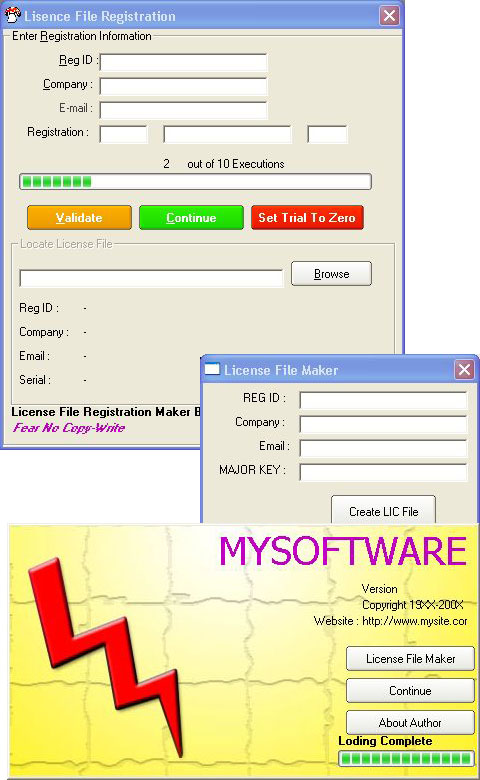



## License File Registration Xp

### Description

READ THIS: License File Registration Maker is an ADVANCED PROTECTION TOOL for you programs. This program uses STRONG Encryption standards to create license file. With inbuilt License file Generator which uses these encryption standards, you can create your own license file. Have a look at screenshot. This program uses DOUBLE SECURITY- where user is required to enter a VALIDATION INFORMATION which enables the License file location section. In this section user must locate the ENCRYPTED LICENSE FILE. Which will be verified securly and then the TRIAL of the program is disabled. Unlike other programs, my program creates a UNIQUE LICENSE FILE according to the user information or validation information. And license file is also encrypted which makes a Program much Stonger for and cracking. The program uses a secure trial feature where only some executions are provided- after which the user should only register the software to continue using it. Many softwares are now switching to license file registration meathod for example a Program called Tweak Xp uses a strong License file which contains the User license and other information. You can download Tweak Xp from www.totalidea.com. Same way my program uses a license file which is valid only if validation information provided is correct. I know several other protection schemes are available but Why take chances- when you have the cheap and best?Users can manipulate and twist my program the way they want it. With sophisticated features and easy to use programming, what more does a developer ask for?If you need still more secured program then download my other source code "INTERNET PRODUCT ACTIVATION". Don't Forget to VOTE for me ---°Sri Harish°
 
### More Info
 

             |
---                |---
**Submitted On**   |2003-02-22 14:45:56
**By**             |[Sriharish\.H](https://github.com/Planet-Source-Code/PSCIndex/blob/master/ByAuthor/sriharish-h.md)
**Level**          |Beginner
**User Rating**    |4.7 (135 globes from 29 users)
**Compatibility**  |VB 5\.0, VB 6\.0
**Category**       |[Complete Applications](https://github.com/Planet-Source-Code/PSCIndex/blob/master/ByCategory/complete-applications__1-27.md)
**World**          |[Visual Basic](https://github.com/Planet-Source-Code/PSCIndex/blob/master/ByWorld/visual-basic.md)
**Archive File**   |[License\_Fi1548842222003\.zip](https://github.com/Planet-Source-Code/sriharish-h-license-file-registration-xp__1-43445/archive/master.zip)

